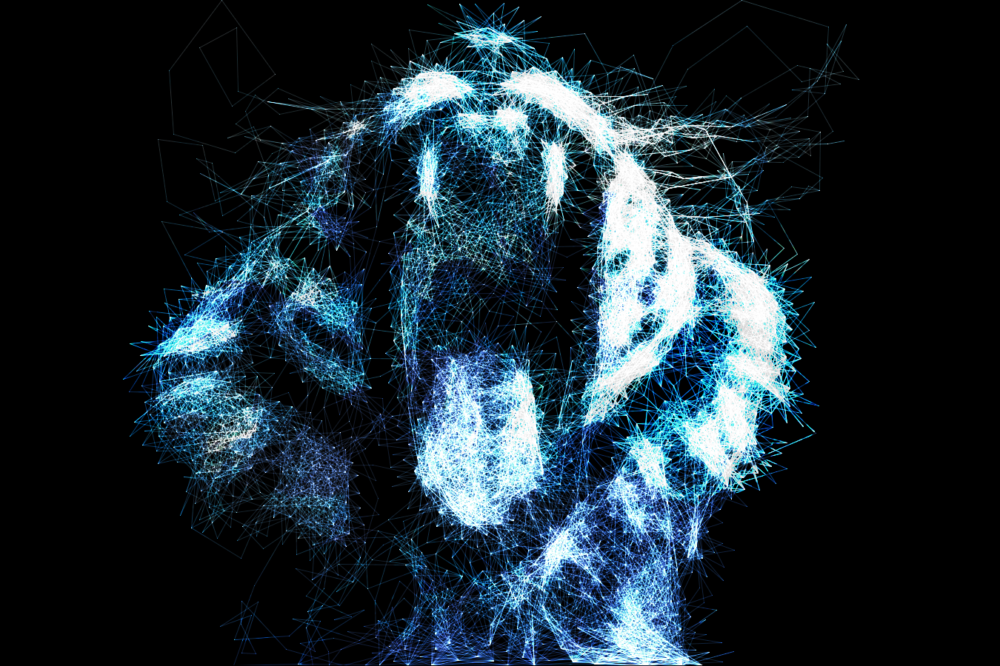


# String Art Exploration

This project is an exploration of string art algorithms using python.


## Description

I explore multiple ways to create art from images using simulated sewing strings across various distributions of nails over a canvas

## Getting Started

### Dependencies
Create a python 3 environment (for exemple using conda) and install dependencies:
```sh
   $ pip install -r requirements.txt
   ```
### Executing program

* First, open string_art.py and edit the "INPUT PARAMETERS SECTION". Each parameter is well described in comments.
* Run the program
```sh
   $ python string_art.py
   ```
* The program will compute some cache data and start rendering
* you can pause the execution with any key while focusing on an image. Resume with any other key.
* At a given frequency, rendering images will be saved to "steps/[image_name]/run_***/[image_name_*******.png]"

## Layout Modes Samples
### Point Cloud
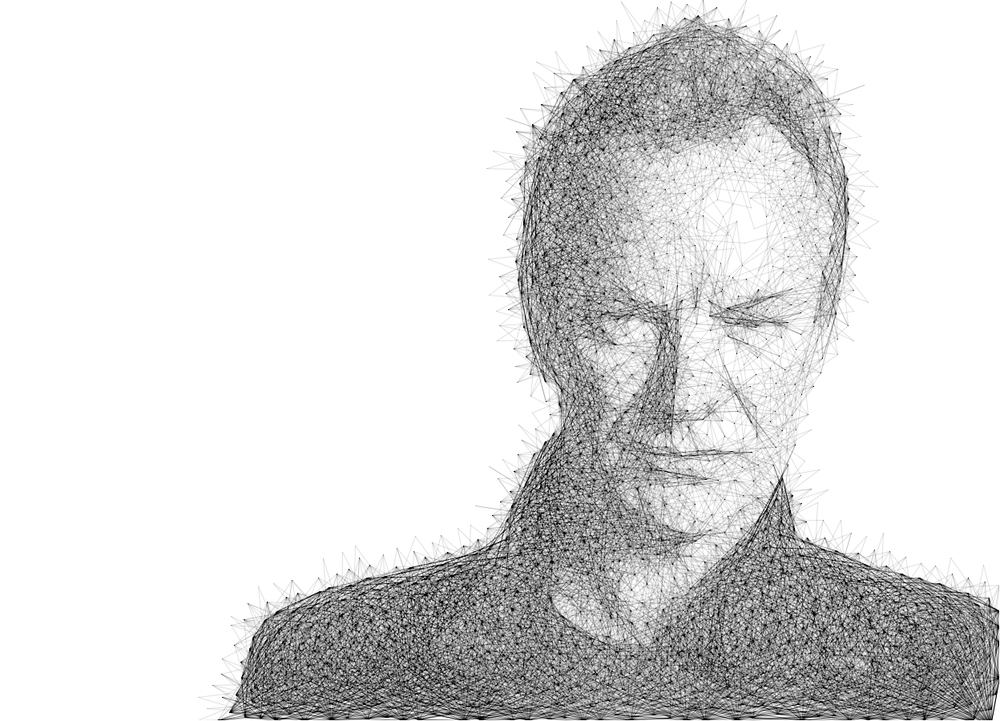
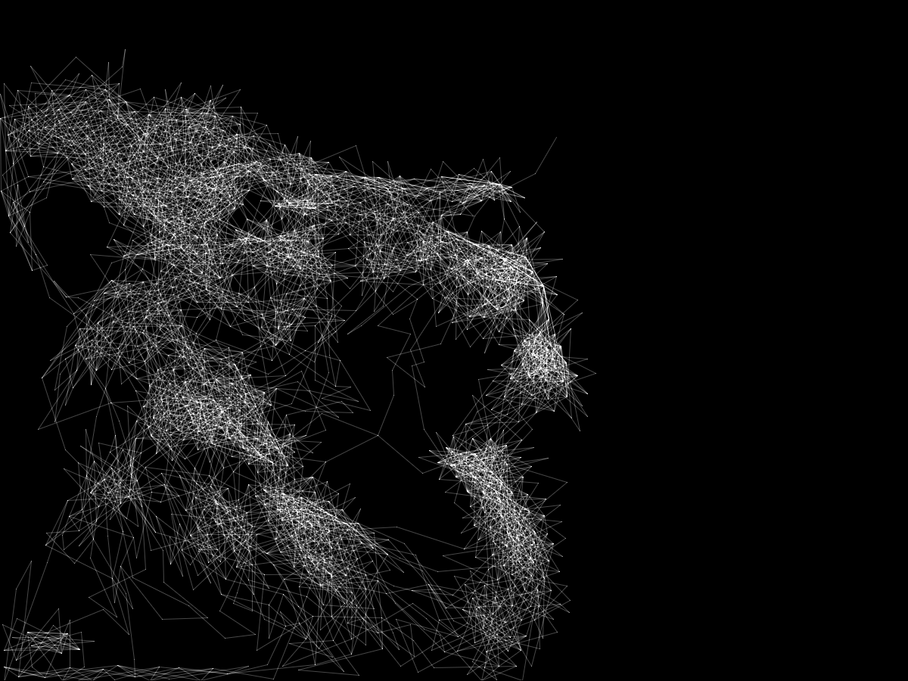
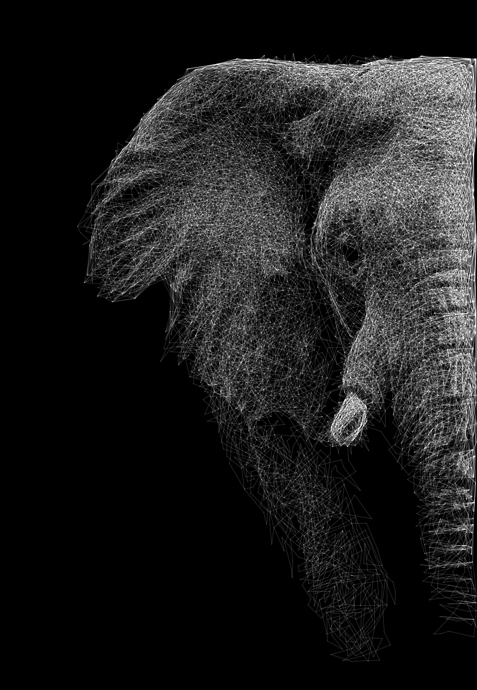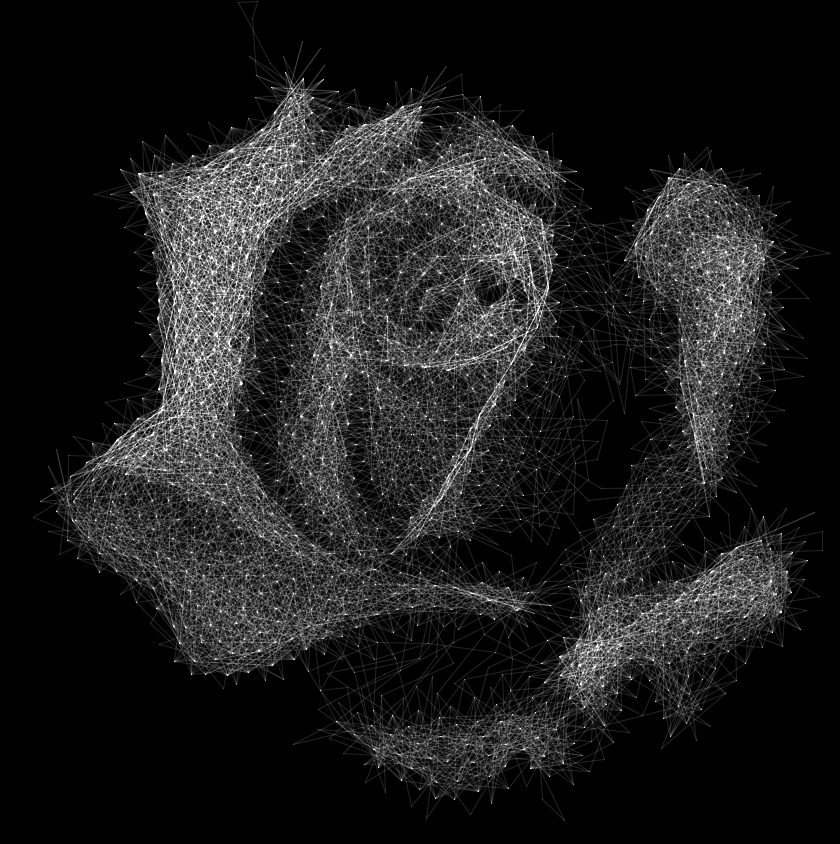

### Rectangle
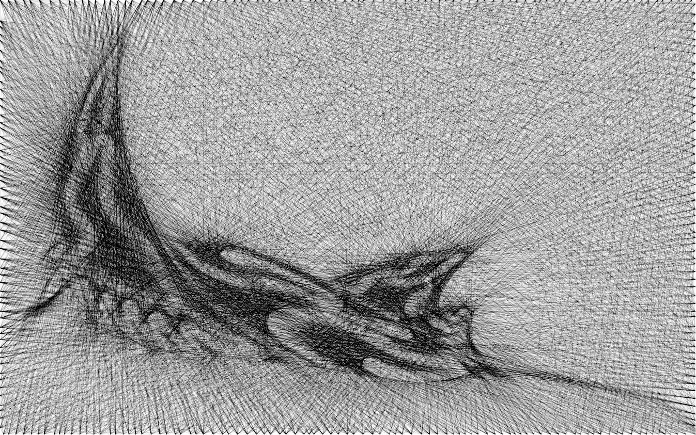

### Circle
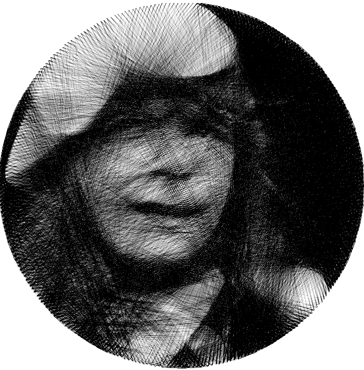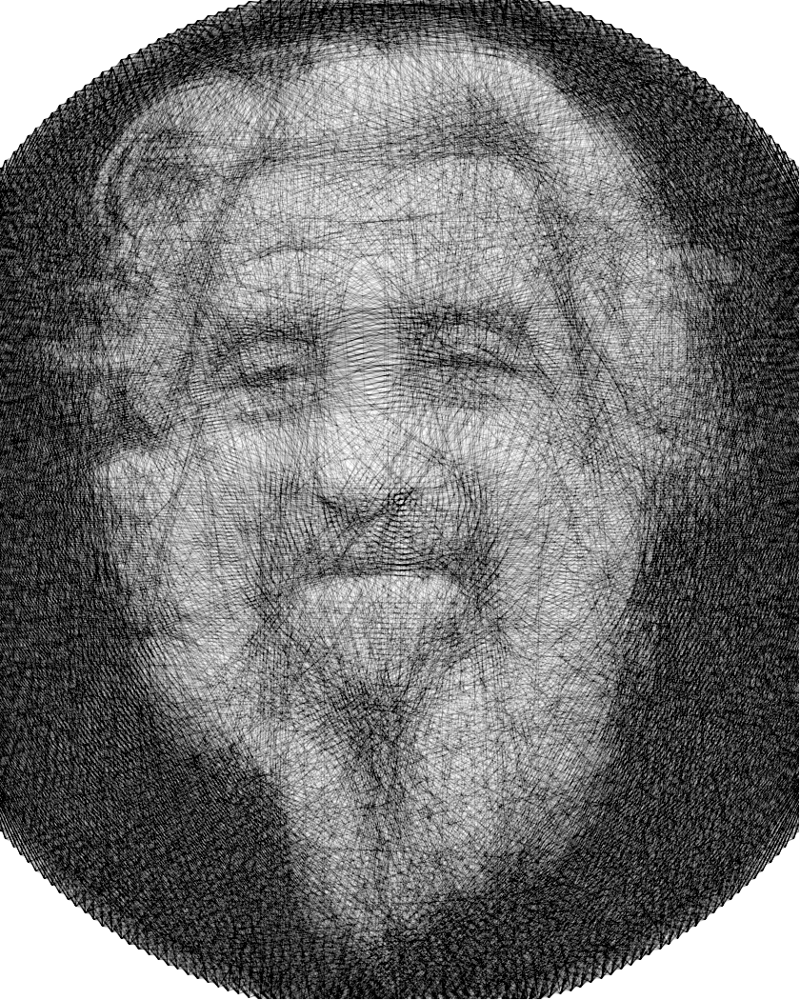

### Perimeter
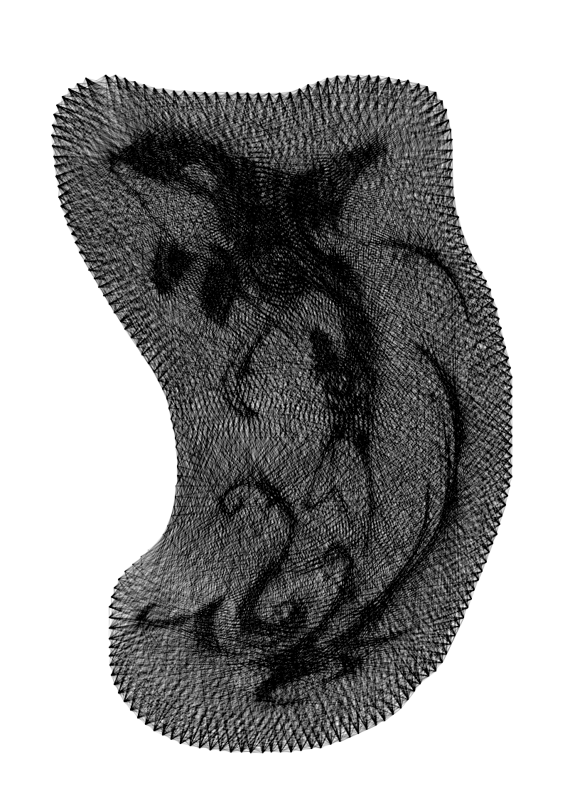

## "Invert" parameter sample
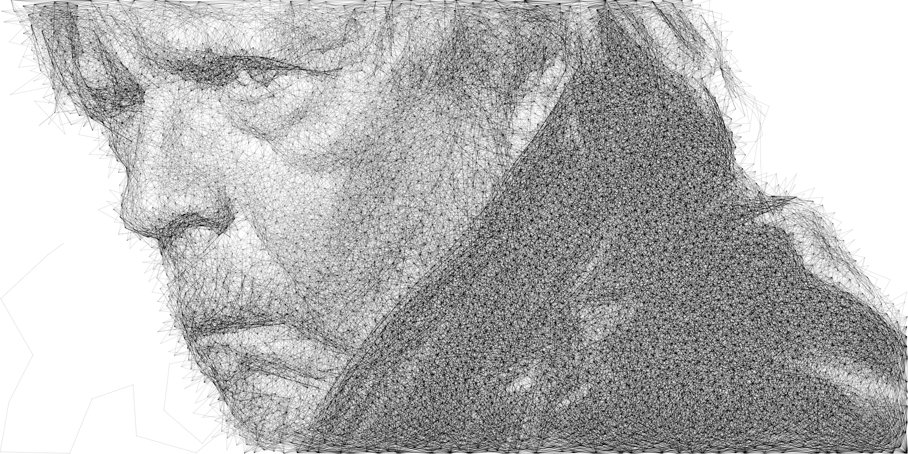
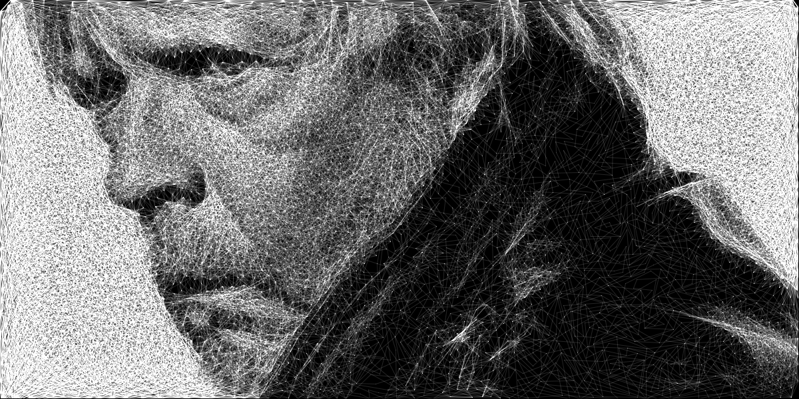
## Authors
Cédric Syllebranque

## Version History

* 0.1
    * Initial Release

## License

Distributed under the MIT License. See `LICENSE.txt` for more information.

## Acknowledgments

Inspiration, code snippets, etc.
* https://www.youtube.com/watch?v=RSRNZaq30W0
* https://www.youtube.com/watch?v=UsbBSttaJos
* [nailedit](https://github.com/hooyah/nailedit)


<!-- ROADMAP -->
## Roadmap

- [ ] Add Changelog
- [ ] Add json parameters
- [ ] Add Additional Templates w/ Examples

See the [open issues](https://github.com/syllebra/string_art/issues) for a full list of proposed features (and known issues).
